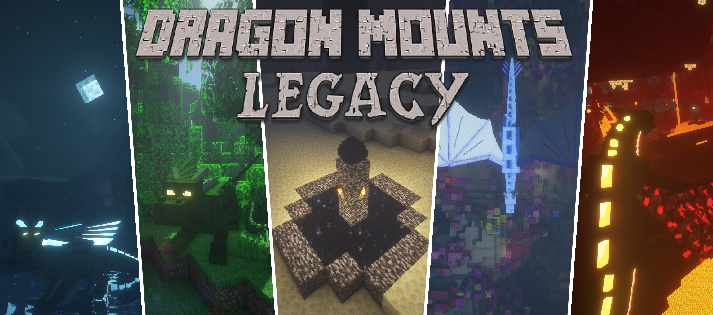

___

GitHub Repository for the Dragon Mounts: Legacy Minecraft Mod.

> "A Minecraft mod that allows you to breed dragon eggs and foster them to ridable dragons."
>
> BarracudaATA

> Dragon Mounts by Barracuda can be found [here](https://www.minecraftforum.net/forums/mapping-and-modding-java-edition/minecraft-mods/wip-mods/1439594-dragon-mounts-r46-wip),
with the github repo [here](https://github.com/ata4/dragon-mounts).
