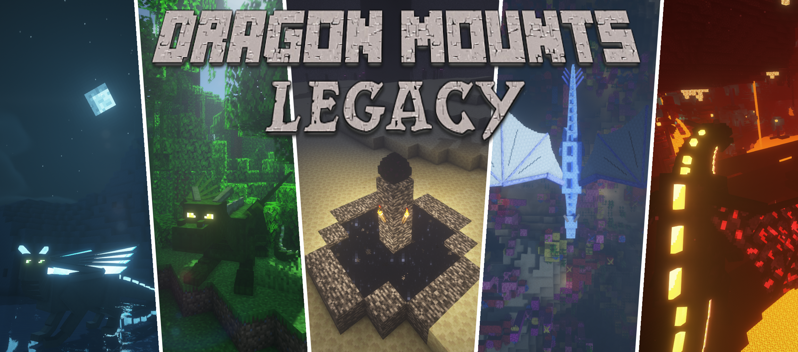

NOTICE: This is a fork of Dragon Mounts: Legacy by Kay9Unit, for the original mod please go to their page, all credits go to them and their contributors but do not report bugs caused by this fork to them! Report it to me instead.

This mod is incompatible with Dragon Mounts Patches since it incorporated the issues that dragon mounts patches fixes. The mixins will be incompatible with the base code be advised.

TWEAKS:

- New Dragon Breaths! Besides Fire, there are Ice, Storm, Wither, and Ender Breaths now corresponding to appropriate dragon breeds.

- Dragons now shoot breath balls occasionally when in combat.

- When ridden, dragons can shoot fireballs via keybind (default: G)

- Dragons can be dual ridden by players
- The owner is the only one that can control the dragon
- The owner is the only one that can activate the fireball breath via keybind
- When the owner dismounts, dies, or disconnects, the 2nd passenger will be forcefully dismounted as well

- Dragons can now be given armor via Copper, Iron, Gold, Emerald, Diamond, and Netherite blocks. Each provide a different armor value. Armor can be retrieved via shear like the saddle. If given another block while wearing armor, the armor will swap and the player will get the previous armor's block back.

- Added Chest Mechanics. Players can give dragons a chest and they can access them via keybind (default: H) whenever they are riding them or looking at them (vanilla interaction range). Chest can be retrieved via shear like the saddle. If the dragon dies or the chest is sheared away from the dragon, the contents drop to the ground.

- New Dragon textures and Dragon Types!

- Updated the textures of some of the original dragons.

- Added the Storm Dragon, lower armor with slightly fast movement speed, flight speed, and is immune to lightning bolt damage. Can be hatched when surrounded by copper blocks.

- Added the Blue Fire Dragon. Can be hatched via obsidian. Its egg looks like a fire dragon's egg but will emite soul fire particles.

- Added the Terra Dragon. They have increased HP and armor and are immune to stalagmite and stalactite. Can be hatched via andesite, granite, diorite, and terracotta blocks.

- Added the Zombie Dragon. They have less armor and HP but they have drowning, poison and magic immunity. Can be hatched via bone blocks.

- Added the Solar Dragon. Immune to withering. Can be hatched via gold blocks.

- Added the Lunar Dragon. Immune to withering. Can be hatched via crying obsidian.

- Added the Aurora Dragon. Immune to freezing. Can be hatched via purpur blocks.

- Added the Magic Dragon. Immune to magic. Shoots ender breath balls. Can be hatched via enchantment table blocks.

- Added the Crystal Dragon. They have increased HP and armor and are immune to stalagmite and stalactite. Can be hatched via amethyst blocks.

- Added the Bronze Dragon. They are the same as Storm Dragons. Can be hatched via redstone lamps.

- Soul Fire-able blocks can no longer hatch the Nether Dragon, it will instead hatch the new variant: Soul Nether Dragon (cosmetic change only). The Nether Dragon egg will emit normal fire particles while the Soul Nether Dragon egg will emit soul fire particles. They can be hatched by blocks that can emit soul fire.

- Prismarine and Sea Lantern can no longer hatch the Water dragon, it will instead hatch the new variant: Ocean Dragon (cosmetic change only). The Water Dragon egg will emit dripping water particles while the Ocean Dragon egg will emit bubbles.

- Added the Wither Dragon. They are immune to withering but has slightly low hp. They can shoot wither skulls which inflict wither.

- Added the Gale Dragon. They are very similar to Aether Dragons. Can be hatched via blue terracotta blocks

- Added the Sculk Dragon. Immune to in wall damage and sonicboom. Can be hatched via sculk blocks

- Added the Primal End Dragon. Can be hatched via endstone

- Added the Primal Nether Dragon can be hatched via red terracotta blocks

- Added fish items to items that can heal dragons (I found it weird that you can tame them with fish but you can only heal them with meat).

- Aether Dragons can be hatched via glowstone blocks now

- Added the Eclipse Dragon. Can be hatched via yellow terracotta blocks

- Added the Dark Dragon. Can be hatched via black terracotta blocks. Shoots wither breath balls. Immune to lightning bolts and freezing.

- Dragon variants' attribute tweaks
- All dragons are fire immune
- All dragons have increased health and armor
- All dragons have natural regeneration
- End Dragons and Water Dragons have their HP increased
- Ice Dragons and Fire Dragons have their damage increased
- Forest Dragons have increased movement speed
- Aether Dragons are unchanged since their +flight speed attribute is enough as it is
- Nether Dragons are also unchanged since their default +armor is enough as it is
- Ghost Dragons have less HP but has armor toughness and immunity to arrows

- Dragon breath (fire) now sets entities on fire when it hits them directly if they are not fire immune and are in the explosion radius. 
- It will also ensure that it has damage and sets things on fire more consistently. 
- It respects doFireTick and mobGriefing gamerules. 
- It now lights up blocks that can be lit like candles, campfires, redstone lamps, smokers, furnaces, blast furnaces, and tnt. If a modded block has the "LIT" blockstate, that will get lit as well.

- Dragon breath (ice) will apply the freeze effect to mobs if they are not freeze immune. It also has a chance of summoning a snow field that slows and gives mining fatigue to mobs upon explosion or impact. It will put fire out on block surfaces (fire extinguisher style) and unlight lit blocks like (campfires, candles, lamps, etc.)

- Dragon breath (end) has a chance of summoning a harming cloud upon explosion or impact.

- Dragon breath (storm) has a chance of summoning lightning and a lightning field that damages mobs upon explosion or impact.

- Dragon breath (wither) inflicts withering on entities caught in the radius. Places wither roses on victims.

- Updated JP and UK translations.

- Tweaked dragon tails of Nether, Water, Ghost, and Forest dragons.

- Added configs for dragon breaths.

Huge thanks to the Dragon Mounts 2 team for allowing me to use the updated textures for dragons!

Dragon Mounts Discord: https://discord.gg/Ewm8aTTJ3K

Please checkout https://www.curseforge.com/minecraft/mc-mods/dragon-mounts-2 made by the Dragon Mounts 2 team if you want to play in 1.12.2 !

=== DO NOT DOWNLOAD FROM OTHER WEBSITES, I ONLY UPLOADED THIS TO CURSEFORGE ===

___

GitHub Repository for the Dragon Mounts: Legacy Minecraft Mod.

> "A Minecraft mod that allows you to breed dragon eggs and foster them to ridable dragons."
>
> BarracudaATA

> Dragon Mounts by Barracuda can be found [here](https://www.minecraftforum.net/forums/mapping-and-modding-java-edition/minecraft-mods/wip-mods/1439594-dragon-mounts-r46-wip),
with the github repo [here](https://github.com/ata4/dragon-mounts).
